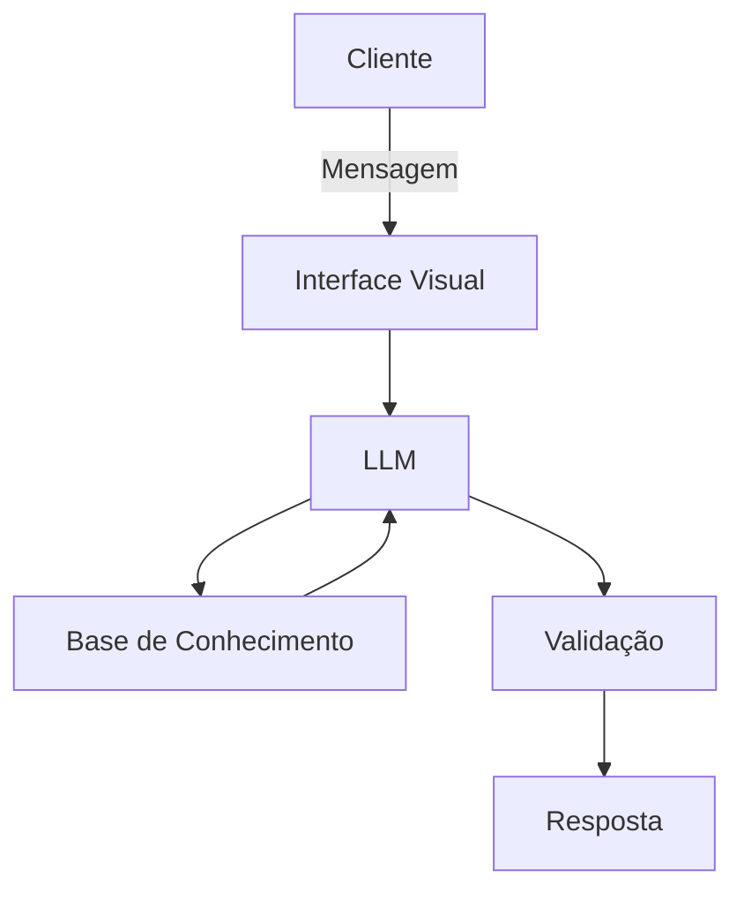

# CIA – Inteligência Artificial contra o Consumismo

## 📌 Visão Geral
O **CIA** é um agente financeiro educativo e consultivo, criado para ajudar pessoas endividadas ou desorganizadas financeiramente a retomarem o controle de suas finanças.  
Ele atua de forma proativa, ensinando conceitos de juros, impostos e investimentos, analisando gastos e propondo soluções para quitar dívidas e organizar o orçamento.

---

## 🚀 Funcionalidades
- Ensina sobre **juros, impostos e investimentos** com exemplos práticos.  
- Mapeia entradas e saídas financeiras, mostrando **últimos gastos e saldo disponível**.  
- Sugere soluções para **quitar dívidas e reorganizar o orçamento**.  
- Aponta formas de **gerar renda extra**.  
- Atua com **segurança e anti-alucinação**, respondendo apenas com base nos dados fornecidos.  

---

## 🎭 Persona
- **Nome:** CIA (Inteligência Artificial contra o Consumismo)  
- **Personalidade:** Educativo, consultivo, analítico, empreendedor  
- **Tom de Voz:** Formal, técnico, acessível  
- **Exemplo de saudação:**  
  > "Olá, meu nome é CIA, seu assistente virtual. Como posso te ajudar?"

---

## 🏗 Arquitetura


## 🏗 Componentes

| Componente | Descrição |
|------------|-----------|
| Interface | Streamlit |
| LLM | Ollama (local), Gemini (teste alfa) |
| Base de Conhecimento | JSON/CSV mockados, Kaggle, HuggingFace |
| Validação | Checagem de alucinações |

---

## 📂 Base de Conhecimento

| Arquivo | Formato | Uso |
|---------|---------|-----|
| `historico_atendimento.csv` | CSV | Contexto de interações anteriores |
| `perfil_investidor.json` | JSON | Personalização de explicações |
| `produtos_financeiros.json` | JSON | Exemplos de investimentos |
| `transacoes.csv` | CSV | Análise de padrão de gastos |
| `personal_finance_customer_data.csv` | CSV | Arquetipo do cliente |
| `credit_risk.csv` | CSV | Dívidas e inadimplência |

---

## 🔒 Segurança

- Não recomenda investimentos sem perfil do cliente.  
- Não acessa dados sensíveis (senhas, CPFs, etc.).  
- Não substitui profissionais certificados.  
- Responde apenas com base nos dados fornecidos.  

---

## 📊 Métricas de Qualidade

- **Assertividade:** Responde corretamente ao que foi perguntado.  
- **Segurança:** Evita inventar informações.  
- **Coerência:** Respostas adequadas ao perfil do cliente.  

---

## 🎤 Pitch

📹 Vídeo do Pitch: Google Drive [(drive.google.com in Bing)](https://www.bing.com/search?q="https%3A%2F%2Fdrive.google.com%2Ffile%2Fd%2F1ecPOKmyrCUimD4pNg-XHb2xLf0Kl_C9O%2Fview%3Fusp%3Dvids_web")

---

## ⚙️ Instalação e Uso

### Pré-requisitos
- Python 3.10+  
- Streamlit  
- Ollama ou Gemini (para LLM)  
- Bibliotecas: `pandas`, `json`, `csv`  

### Instalação
```bash
# Clone o repositório
git clone https://github.com/seuusuario/cia-agente-financeiro.git

# Acesse a pasta
cd cia-agente-financeiro


