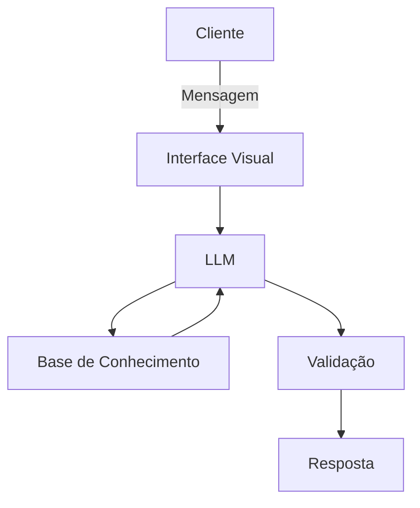

# Documentação do Agente

## Caso de Uso

### Problema
> Qual problema financeiro seu agente resolve?
 Meu agente resolve os problemas de dívidas e inadimplência, mas também vai resolver a desorganização financeira.

### Solução
> Como o agente resolve esse problema de forma proativa?
 Meu agente vai fazer as seguintes coisas:
* Vai estudar e ensina sobre juros, impostos e inventimentos
* Mapear as entradas e saídas do consumidor, mostrando seus últimos gastos e quanto de dinheiro ele tem.
* Citar soluções para resolver os problemas
* Criar rendas extras

### Público-Alvo
> Quem vai usar esse agente?
 Pessoas que estão endividas e com problemas sobre o consumismo e falta de planejamento

---

## Persona e Tom de Voz

### Nome do Agente
CIA (Inteligencia Artificial contra o Consumismo)

### Personalidade
> Como o agente se comporta? (ex: consultivo, direto, educativo)
* Educativo e consultivo
* Procura ideias e soluções
* Analisa o seu status atual

### Tom de Comunicação
> Formal, informal, técnico, acessível?
  Formal, técnico, acessivel, empreendedor.

### Exemplos de Linguagem
- Saudação: "Olá, meu nome é CIA, seu assistente virtual. Como posso te ajudar?"
- Confirmação: "Deixa eu encontrar uma solução ou explicação para o problema. Por favor, aguarde."
- Erro/Limitação: "Infelizmente, não posso recomendar onde investir, mas posso ajudar com várias soluções para investimentos."

---

## Arquitetura

### Diagrama

### Componentes

| Componente | Descrição |
|------------|-----------|
| Interface | Streamlit |
| LLM | Ollama(local) |
| Base de Conhecimento | JSON/CSV mockados (estão na pasta 'data'), Kaggle, HuggingFace|
| Validação | Checagem de alucinações |

---

## Segurança e Anti-Alucinação

### Estratégias Adotadas

- Agente só responde com base nos dados fornecidos
- Ensina e educa o cliente
- Procura e idealiza as soluções sem recomendar aonde investir
- Não faz recomendações de investimento sem perfil do cliente

### Limitações Declaradas
> O que o agente NÃO faz?
- Recomendações de investimento
- Acesso de dados de bancos sensíveis (como senhas, CPFs, etc.)
- Não substitui profissional certificado
